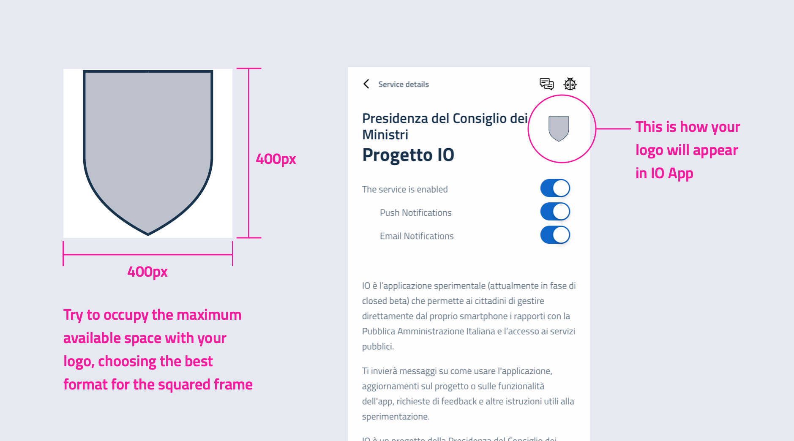
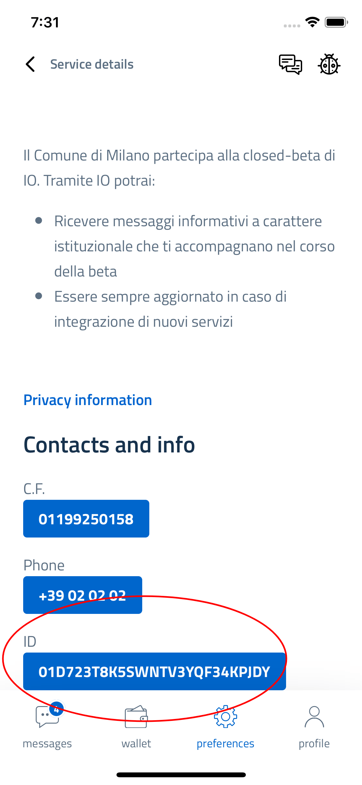

# Instructions to add a new logo

## How to create a logo

Create a `id.png` PNG image with dimensions of 400x400 pixels, where `id` (in lower case) is the **ID** of the service, e.g **abcedef0123.png**

You can find the **ID** in the service detail screen in the IO app

## Compress the logo

We strictly recommend to compress your logo: in this way it can be easily downloaded and displayed by the IO app.
Here a list of most used tools for image compression:

- https://compresspng.com/it/ (online)
- https://tinypng.com/ (online)
- https://pngquant.org/ (cli)
